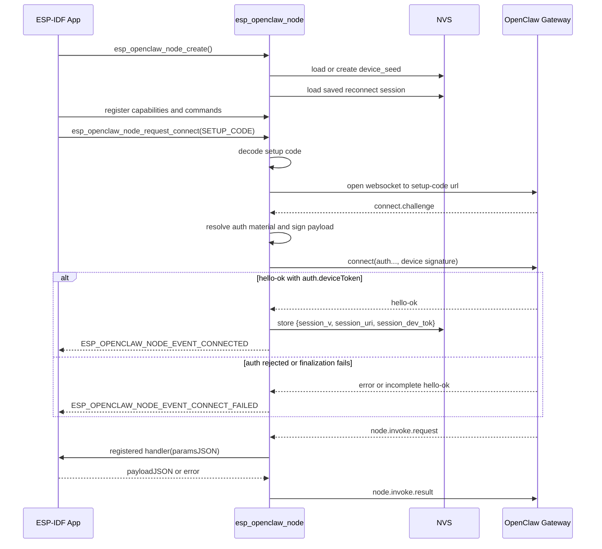

# esp-openclaw-node

`esp-openclaw-node` is the ESP-IDF component package in this repository for
running an ESP32 application as an OpenClaw Node over WebSocket.
The public C API is declared in
[esp_openclaw_node.h](./include/esp_openclaw_node.h) and uses the
`esp_openclaw_node_*` prefix.

The component provides:

- Device identity generation and persistence
- OpenClaw `connect.challenge` signing and `connect` request construction
- setup-code, shared-token, password, no-auth, and saved-session connect paths
- capability, scope, and command advertisement
- Handling `node.invoke.request` commands and sending `node.invoke.result` replies

## Contents

- [Requirements](#requirements)
- [Overview](#overview)
  - [What The Component Handles](#what-the-component-handles)
  - [What The Application Handles](#what-the-application-handles)
- [Public API](#public-api)
  - [Lifecycle](#lifecycle)
  - [Registration](#registration)
  - [Async Control](#async-control)
  - [Inspection](#inspection)
- [Usage](#usage)
  - [Basic Lifecycle](#basic-lifecycle)
  - [Quick Start](#quick-start)
  - [Configuration And Defaults](#configuration-and-defaults)
  - [Registering Capabilities And Commands](#registering-capabilities-and-commands)
  - [Command Handlers](#command-handlers)
- [Connect and Session Model](#connect-and-session-model)
  - [Connect Model](#connect-model)
  - [Supported Connect Sources](#supported-connect-sources)
  - [Setup Codes](#setup-codes)
  - [Events](#events)
  - [Stored State](#stored-state)
- [Reference](#reference)
  - [TLS](#tls)
  - [Examples and Reconnect Policy](#examples-and-reconnect-policy)
  - [Component Tests](#component-tests)

## Requirements

- ESP-IDF `5.x`
- a board that can reach the OpenClaw Gateway
- application-managed network setup, such as Wi-Fi or Ethernet
- `nvs_flash_init()`, `esp_netif_init()`, and the default event loop before the
node is created or connected

## Overview

### What The Component Handles

- Generating or loading the device seed from NVS
- Deriving the Ed25519 keypair and stable `device_id`
- Opening one WebSocket transport at a time
- Handling `connect.challenge`
- Building and signing the OpenClaw `connect` request
- Advertising capabilities and commands
- Dispatching `node.invoke.request` into registered handlers
- Sending `node.invoke.result`
- Persisting the final `{ gateway_uri, device_token }` reconnect session after a
successful `hello-ok`

### What The Application Handles

- Wi-Fi, Ethernet, PPP, or any other route to the gateway
- Local UI, REPL, or provisioning flows
- How setup codes, gateway URIs, tokens, or passwords reach the board
- Deciding whether the next attempt should use a saved session or explicit auth
- Deciding whether and when to retry after `CONNECT_FAILED` or `DISCONNECTED`
- Any factory reset, identity reset, or saved-session clear workflow
- The actual device-specific command handlers

## Public API

### Lifecycle

- `esp_openclaw_node_config_init_default()`
- `esp_openclaw_node_create()`
- `esp_openclaw_node_destroy()`

### Registration

- `esp_openclaw_node_register_capability()`
- `esp_openclaw_node_register_scope()`
- `esp_openclaw_node_register_command()`

### Async Control

- `esp_openclaw_node_request_connect()`
- `esp_openclaw_node_request_disconnect()`

### Inspection

- `esp_openclaw_node_get_device_id()`
- `esp_openclaw_node_has_saved_session()`

The component is driven through registration, one explicit connect request at a
time, and terminal events.

## Usage

### Basic Lifecycle

1. Initialize NVS, `esp_netif`, and the default event loop.
2. Bring up networking, or arrange to wait for it before connecting.
3. Initialize `esp_openclaw_node_config_t` with
  `esp_openclaw_node_config_init_default()`.
4. Create the node with `esp_openclaw_node_create()`.
5. Register capabilities, scopes, and commands before the first accepted connect request.
6. Submit one connect request with `esp_openclaw_node_request_connect()`.
7. Wait for a terminal event before submitting the next control request.
8. Destroy the node with `esp_openclaw_node_destroy()` when finished.

### Quick Start

```c
#include <string.h>
#include "esp_openclaw_node.h"

static esp_err_t handle_device_info(
    esp_openclaw_node_handle_t node,
    void *context,
    const char *params_json,
    size_t params_len,
    char **out_payload_json,
    esp_openclaw_node_error_t *out_error)
{
    (void)node;
    (void)context;
    (void)params_json;
    (void)params_len;
    (void)out_error;

    *out_payload_json = strdup("{\"status\":\"ok\"}");
    return *out_payload_json != NULL ? ESP_OK : ESP_ERR_NO_MEM;
}

static void handle_node_event(
    esp_openclaw_node_handle_t node,
    esp_openclaw_node_event_t event,
    const void *event_data,
    void *user_ctx)
{
    (void)node;
    (void)event_data;
    (void)user_ctx;

    if (event == ESP_OPENCLAW_NODE_EVENT_CONNECT_FAILED) {
        /* Decide whether and when to retry in application code. */
    }
}

void app_main(void)
{
    esp_openclaw_node_config_t config = {0};
    esp_openclaw_node_handle_t node = NULL;
    const char *setup_code = "<setup-code>";

    esp_openclaw_node_config_init_default(&config);
    config.event_cb = handle_node_event;

    ESP_ERROR_CHECK(esp_openclaw_node_create(&config, &node));
    ESP_ERROR_CHECK(esp_openclaw_node_register_capability(node, "device"));
    ESP_ERROR_CHECK(esp_openclaw_node_register_scope(node, "operator.read"));

    esp_openclaw_node_command_t cmd = {
        .name = "device.info",
        .handler = handle_device_info,
    };
    ESP_ERROR_CHECK(esp_openclaw_node_register_command(node, &cmd));

    esp_openclaw_node_connect_request_t request = {
        .source = ESP_OPENCLAW_NODE_CONNECT_SOURCE_SETUP_CODE,
        .gateway_uri = NULL,
        .value = setup_code,
    };
    ESP_ERROR_CHECK(esp_openclaw_node_request_connect(node, &request));
}
```

### Configuration And Defaults

`esp_openclaw_node_config_init_default()` sets:

- `display_name = "OpenClaw ESP32"`
- `platform = "esp32"`
- `device_family = "ESP32"`
- `client_id = "node-host"`
- `client_mode = "node"`
- `role = "node"`
- `model_identifier = CONFIG_IDF_TARGET`
- `locale = "en-US"`
- `use_cert_bundle = true`
- `tls_common_name = NULL`
- `tls_cert_pem = NULL`
- `skip_cert_common_name_check = false`

### Registering Capabilities, Scopes, And Commands

Register everything before the first connect request.

```c
ESP_ERROR_CHECK(esp_openclaw_node_register_capability(node, "display"));
ESP_ERROR_CHECK(esp_openclaw_node_register_scope(node, "operator.approvals"));
ESP_ERROR_CHECK(esp_openclaw_node_register_scope(node, "operator.read"));

esp_openclaw_node_command_t cmd = {
    .name = "display.show",
    .handler = handle_display_show,
    .context = &display_state,
};
ESP_ERROR_CHECK(esp_openclaw_node_register_command(node, &cmd));
```

Rules:

- capabilities and scopes are plain strings
- commands are plain strings plus a handler and optional context pointer
- Duplicate capability, scope, or command names are ignored and return `ESP_OK`
- Registration is allowed only when no session is active and no connect or
  disconnect request is in flight
- Registration and transport resource limits default to
`ESP_OPENCLAW_NODE_MAX_CAPABILITIES`, `ESP_OPENCLAW_NODE_MAX_SCOPES`, `ESP_OPENCLAW_NODE_MAX_COMMANDS`,
the internal work-queue length, and the component/WebSocket task and buffer
sizes. These can be tuned in `menuconfig` under
`Component config -> ESP OpenClaw Node`.

Current `menuconfig` options and defaults:

- `CONFIG_ESP_OPENCLAW_NODE_MAX_CAPABILITIES` = `16`
- `CONFIG_ESP_OPENCLAW_NODE_MAX_SCOPES` = `8`
- `CONFIG_ESP_OPENCLAW_NODE_MAX_COMMANDS` = `32`
- `CONFIG_ESP_OPENCLAW_NODE_WORK_QUEUE_LENGTH` = `32`
- `CONFIG_ESP_OPENCLAW_NODE_TASK_STACK_SIZE` = `8192`
- `CONFIG_ESP_OPENCLAW_NODE_TRANSPORT_TASK_STACK_SIZE` = `8192`
- `CONFIG_ESP_OPENCLAW_NODE_TRANSPORT_BUFFER_SIZE` = `2048`

The component advertises capability names, scope names, and command names only. It does not
currently send parameter schemas to the gateway.

### Command Handlers

Handler signature:

```c
typedef esp_err_t (*esp_openclaw_node_command_handler_t)(
    esp_openclaw_node_handle_t node,
    void *context,
    const char *params_json,
    size_t params_len,
    char **out_payload_json,
    esp_openclaw_node_error_t *out_error);
```

Handler behavior:

- handlers run synchronously on the component task
- `params_json` is the raw UTF-8 JSON string from `payload.paramsJSON`
- when the request omits `paramsJSON`, the component passes `"{}"`
- the component always passes `out_payload_json` and initializes
`*out_payload_json` to `NULL` before calling the handler
- on success, return `ESP_OK` and either leave `*out_payload_json` as `NULL`
to send no payload or assign a UTF-8 JSON string to `*out_payload_json`
- on failure, return a non-`ESP_OK` code and populate `out_error` with a stable
error `code` and human-readable `message`
- any non-`NULL` `*out_payload_json` buffer must be `malloc()`-compatible; the
component sends it as `payloadJSON` and then frees it

Because handlers run on the component task, long-running work should be handed
off to another task if it cannot complete quickly.

## Connect and Session Model

### Connect Model

The component performs one connection attempt at a time. It does not run an
automatic reconnect loop and it does not choose between saved-session reconnect
and explicit auth input on behalf of the application.

Request rules:

- `ESP_OPENCLAW_NODE_CONNECT_SOURCE_SAVED_SESSION` is valid only when a saved
reconnect session is present
Applications can check saved-session availability with
`esp_openclaw_node_has_saved_session()` before submitting that request.
- explicit connect requests are valid only when no session is active and no
  connect or disconnect request is in flight
- `esp_openclaw_node_request_disconnect()` is valid only while the node is ready
- once destroy begins, new async requests are rejected

For each accepted connect request, wait for exactly one terminal outcome before
submitting another control request.

### Supported Connect Sources

The public API exposes five caller-chosen connect sources:

- `ESP_OPENCLAW_NODE_CONNECT_SOURCE_SAVED_SESSION`
- `ESP_OPENCLAW_NODE_CONNECT_SOURCE_SETUP_CODE`
- `ESP_OPENCLAW_NODE_CONNECT_SOURCE_GATEWAY_TOKEN`
- `ESP_OPENCLAW_NODE_CONNECT_SOURCE_GATEWAY_PASSWORD`
- `ESP_OPENCLAW_NODE_CONNECT_SOURCE_NO_AUTH`

Field requirements for `esp_openclaw_node_connect_request_t`:

- `SAVED_SESSION`: `gateway_uri = NULL`, `value = NULL`
- `SETUP_CODE`: `gateway_uri = NULL`, `value = <setup code>`
- `GATEWAY_TOKEN`: `gateway_uri = <ws://...|wss://...>`, `value = <token>`
- `GATEWAY_PASSWORD`: `gateway_uri = <ws://...|wss://...>`,
`value = <password>`
- `NO_AUTH`: `gateway_uri = <ws://...|wss://...>`, `value = NULL`

When a connect attempt begins, the component resolves auth material like this:

- saved session: send `auth.deviceToken`
- explicit gateway token: send `auth.token`
- explicit gateway password: send `auth.password`
- explicit no-auth: omit the `auth` object
- setup code: depends on the decoded credential field

This selection is per attempt. The component does not fall back from one auth
mode to another automatically.

### Setup Codes

In the current component, a setup code is base64url-encoded JSON that must
contain:

- `url`
- exactly one of:
  - `bootstrapToken`
  - `token`
  - `password`

Example decoded payload:

```json
{
  "url": "ws://192.168.1.10:19001",
  "bootstrapToken": "oc_bootstrap_example_token"
}
```

<details>
<summary>Pairing Flow</summary>

The usual first-pairing path is one explicit setup-code connect attempt. The
component does not stage setup-code state for a later `connect` call.



</details>


### Events

The component emits these events through `esp_openclaw_node_event_cb_t`:

- `ESP_OPENCLAW_NODE_EVENT_CONNECTED`
- `ESP_OPENCLAW_NODE_EVENT_CONNECT_FAILED`
- `ESP_OPENCLAW_NODE_EVENT_DISCONNECTED`

`ESP_OPENCLAW_NODE_EVENT_CONNECT_FAILED` carries
`esp_openclaw_node_connect_failed_event_t` with:

- `ESP_OPENCLAW_NODE_CONNECT_FAILURE_TRANSPORT_START_FAILED`
- `ESP_OPENCLAW_NODE_CONNECT_FAILURE_CONNECTION_LOST`
- `ESP_OPENCLAW_NODE_CONNECT_FAILURE_AUTH_REJECTED`
- `ESP_OPENCLAW_NODE_CONNECT_FAILURE_SESSION_FINALIZATION_FAILED`

`ESP_OPENCLAW_NODE_EVENT_DISCONNECTED` carries
`esp_openclaw_node_disconnected_event_t` with:

- `ESP_OPENCLAW_NODE_DISCONNECTED_REASON_REQUESTED`
- `ESP_OPENCLAW_NODE_DISCONNECTED_REASON_CONNECTION_LOST`

Event callback rules:

- callbacks run on the component task
- keep callback code short and non-blocking
- callbacks may call the async request APIs
- callbacks must not call `esp_openclaw_node_destroy()`

### Stored State

The component stores internal state in NVS namespace `openclaw`.

Identity:

- `device_seed`: 32-byte Ed25519 seed

Saved reconnect session:

- `session_v`
- `session_uri`
- `session_dev_tok`

Derived at runtime from `device_seed`:

- `device_id = hex(sha256(public_key))`
- `public_key`
- `private_key`

Persistence rules:

- setup-code bootstrap tokens are never persisted
- explicit shared gateway tokens are never persisted
- explicit gateway passwords are never persisted
- explicit no-auth selections are never persisted
- only the final `{ gateway_uri, device_token }` reconnect session is persisted

## Reference

<details>
<summary>Example Wire Messages</summary>

Example `connect.challenge` from the gateway:

```json
{
  "type": "event",
  "event": "connect.challenge",
  "payload": {
    "nonce": "M2QxYjBiNDItYzJlZS00YzA3LWFkMWMtMmE4NGJmZTg4M2E5",
    "ts": 1774830385123
  }
}
```

Example `connect` from the node:

```json
{
  "type": "req",
  "id": "connect-1774830385140123",
  "method": "connect",
  "params": {
    "minProtocol": 3,
    "maxProtocol": 3,
    "client": {
      "id": "node-host",
      "displayName": "OpenClaw ESP32",
      "version": "1.0.0",
      "platform": "esp32",
      "deviceFamily": "ESP32",
      "modelIdentifier": "esp32c6",
      "mode": "node"
    },
    "role": "node",
    "scopes": ["operator.approvals", "operator.read", "operator.talk.secrets", "operator.write"],
    "caps": ["device", "wifi", "gpio"],
    "commands": [
      "device.info",
      "device.status",
      "wifi.status",
      "gpio.mode",
      "gpio.read",
      "gpio.write"
    ],
    "auth": {
      "deviceToken": "<saved-device-token>"
    },
    "userAgent": "esp-openclaw-node/1.0.0",
    "locale": "en-US",
    "device": {
      "id": "<device-id>",
      "publicKey": "<base64url-public-key>",
      "signature": "<base64url-signature>",
      "signedAt": 1774830385123,
      "nonce": "M2QxYjBiNDItYzJlZS00YzA3LWFkMWMtMmE4NGJmZTg4M2E5"
    }
  }
}
```

`params.auth` variants by connect source:

```json
{ "bootstrapToken": "<bootstrap-token>" }
```

```json
{ "token": "<gateway-token>" }
```

```json
{ "password": "<gateway-password>" }
```

For explicit no-auth, the component omits the `auth` object entirely.

Successful `hello-ok` response:

```json
{
  "type": "res",
  "id": "connect-1774830385140123",
  "ok": true,
  "payload": {
    "type": "hello-ok",
    "protocol": 3,
    "server": {
      "version": "2026.4.9",
      "connId": "<gateway-connection-id>"
    },
    "auth": {
      "deviceToken": "<node-device-token>",
      "role": "node",
      "scopes": [],
      "deviceTokens": [
        {
          "deviceToken": "<bounded-operator-token>",
          "role": "operator",
          "scopes": [
            "operator.approvals",
            "operator.read",
            "operator.talk.secrets",
            "operator.write"
          ]
        }
      ]
    }
  }
}
```

The gateway may return the primary node reconnect token in
`payload.auth.deviceToken` plus additional tokens in
`payload.auth.deviceTokens`.  
This component persists and reuses only
`payload.auth.deviceToken`; it ignores any extra `payload.auth.deviceTokens` entries.

Example `node.invoke.request` from the gateway:

```json
{
  "type": "event",
  "event": "node.invoke.request",
  "payload": {
    "id": "inv_01JV0A7X9S1ZQY7V5NXJYQ5V8K",
    "nodeId": "<node-id>",
    "command": "display.show",
    "paramsJSON": "{\"heading\":\"OpenClaw\",\"text\":\"Hello from the gateway.\"}"
  }
}
```

Successful `node.invoke.result` from the node:

```json
{
  "type": "req",
  "id": "esp32-1774830401987123",
  "method": "node.invoke.result",
  "params": {
    "id": "inv_01JV0A7X9S1ZQY7V5NXJYQ5V8K",
    "nodeId": "<node-id>",
    "ok": true,
    "payloadJSON": "{\"heading\":\"OpenClaw\",\"text\":\"Hello from the gateway.\",\"renderCount\":1}"
  }
}
```

Error `node.invoke.result` from the node:

```json
{
  "type": "req",
  "id": "esp32-1774830402987001",
  "method": "node.invoke.result",
  "params": {
    "id": "inv_01JV0AA4J2QJ4V4X1R7W43G6CE",
    "nodeId": "<node-id>",
    "ok": false,
    "error": {
      "code": "INVALID_PARAMS",
      "message": "display params must include string heading and text fields"
    }
  }
}
```

</details>

### TLS

The component supports both `ws://` and `wss://`.

For `wss://`, one of these trust paths must be configured:

- set `tls_cert_pem` to a PEM trust anchor, or
- leave `use_cert_bundle = true` and build with
`CONFIG_MBEDTLS_CERTIFICATE_BUNDLE`

If neither is true, `wss://` connect requests are rejected before transport
startup.

Useful fields in `esp_openclaw_node_config_t`:

- `tls_cert_pem`
- `tls_cert_len`
- `use_cert_bundle`
- `tls_common_name`
- `skip_cert_common_name_check`

`skip_cert_common_name_check` is available for local development, but should
stay disabled for production-like deployments.

### Examples and Reconnect Policy

The component itself does not implement automatic reconnect policy.

This repository's examples provide that behavior outside the component in
[examples/common/esp_openclaw_node_example_saved_session_reconnect.c](../../examples/common/esp_openclaw_node_example_saved_session_reconnect.c).
That helper:

- waits for Wi-Fi to be online
- checks `esp_openclaw_node_has_saved_session()`
- retries only the saved-session path
- retries after retryable `CONNECT_FAILED` and `DISCONNECTED` outcomes

The application keeps network policy and retry policy, while the component focuses on node identity, protocol, and one attempt  
at a time.

### Component Tests

Component tests live under  
[components/esp-openclaw-node/test_apps](./test_apps/README.md).
